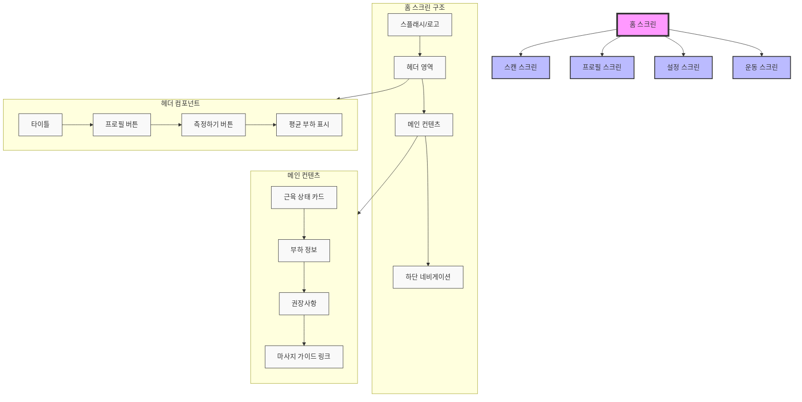
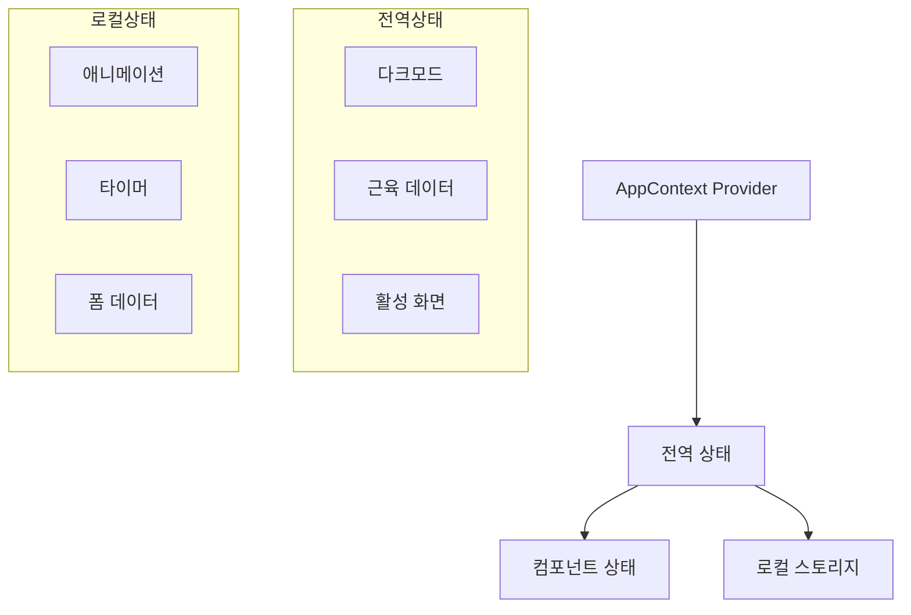

# ArmHealth 앱 아키텍처 문서

## 1. UI 구조

### 1.1 화면 구조 다이어그램


### 1.2 화면별 구성

#### HomeScreen
- **초기 애니메이션**
  ```typescript
  - 조건: localStorage.getItem('hasVisitedHome') === null
  - 순서: 
    1. 로고 페이드인 (0.8s)
    2. 헤더 슬라이드다운 (0.5s)
    3. 컨텐츠 페이드인 (0.8s)
  ```

#### ScanScreen
- **측정 프로세스**
  1. 디바이스 연결
  2. 신호 확인
  3. 측정 실행
  4. 결과 표시

#### ExerciseScreen
- **운동 가이드**
  - 단계별 운동 설명
  - 타이머 기능
  - 진행 상태 표시

## 2. 기술 스택

### 2.1 핵심 프레임워크
- **Next.js 14**
  - App Router 사용
  - Server Components 지원
  - Client-side Navigation
  - 자동 코드 스플리팅

### 2.2 상태 관리


### 2.3 스타일 시스템
```css
:root {
  /* Light Mode */
  --primary: #3B82F6;
  --background: #FFFFFF;
  --text-primary: #111827;
  --text-secondary: #4B5563;
  
  /* Dark Mode */
  --dark-background: #111827;
  --dark-text-primary: #F9FAFB;
  --dark-text-secondary: #9CA3AF;
}

/* 애니메이션 */
.fade-in {
  animation: fadeIn 0.5s ease-out forwards;
}

.slide-up {
  animation: slideUp 0.8s cubic-bezier(0.16, 1, 0.3, 1) forwards;
}
```

## 3. 프로젝트 구조

```bash
src/
├── app/
│   ├── layout.tsx              # 루트 레이아웃
│   ├── page.tsx               # 홈페이지
│   └── components/
│       └── ArmHealthApp/
│           ├── HomeScreen.tsx
│           ├── ScanScreen.tsx
│           ├── ExerciseScreen.tsx
│           ├── ProfileScreen.tsx
│           ├── SettingsScreen.tsx
│           ├── common/
│           │   ├── Header.tsx
│           │   └── TabNavigation.tsx
│           └── animation.css
├── context/
│   └── AppContext.tsx         # 전역 상태 관리
├── types/
│   └── index.ts              # 타입 정의
└── utils/
    └── helpers.ts            # 유틸리티 함수
```

## 4. 데이터 구조

### 4.1 주요 인터페이스
```typescript
// 근육 데이터 타입
interface MuscleData {
  name: string;
  nameEn: string;
  load: number;
  description: string;
  recommendations: string[];
}

// 운동 가이드 타입
interface ExerciseGuide {
  id: string;
  title: string;
  steps: Array<{
    description: string;
    duration: number;
    image?: string;
  }>;
}
```

## 5. 성능 최적화

### 5.1 코드 최적화
```typescript
// 동적 임포트
const ExerciseScreen = dynamic(() => import('./ExerciseScreen'), {
  loading: () => <LoadingSpinner />
});

// 이미지 최적화
<Image
  src="/muscle.png"
  width={300}
  height={200}
  loading="lazy"
  alt="Muscle diagram"
/>

// 컴포넌트 메모이제이션
const MuscleCard = React.memo(({ data }: Props) => {
  // 컴포넌트 로직
});
```

## 6. 보안 & 테스트

### 6.1 로컬 스토리지 관리
```typescript
const storage = {
  set: (key: string, value: any) => {
    localStorage.setItem(key, JSON.stringify(value));
  },
  get: (key: string) => {
    const item = localStorage.getItem(key);
    return item ? JSON.parse(item) : null;
  }
};
```

### 6.2 테스트 케이스
```typescript
// Jest + React Testing Library
describe('HomeScreen', () => {
  it('renders muscle data correctly', () => {
    render(<HomeScreen />);
    expect(screen.getByText(/평균 부하/i)).toBeInTheDocument();
  });
});
```

## 7. 배포 & 모니터링

### 7.1 배포 프로세스
- Vercel 플랫폼 사용
- 자동 HTTPS 적용
- Edge Functions 활용

### 7.2 모니터링
- Next.js Analytics
- Core Web Vitals 추적
- Sentry 에러 추적 (예정)
- 사용자 행동 분석 