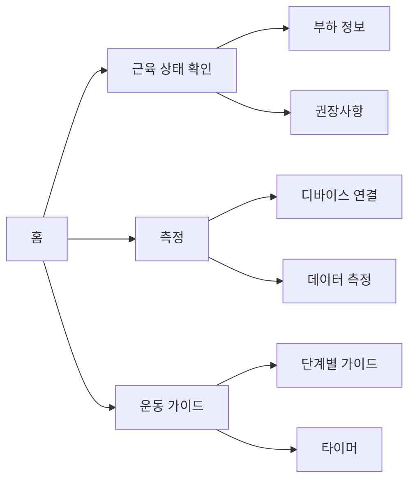
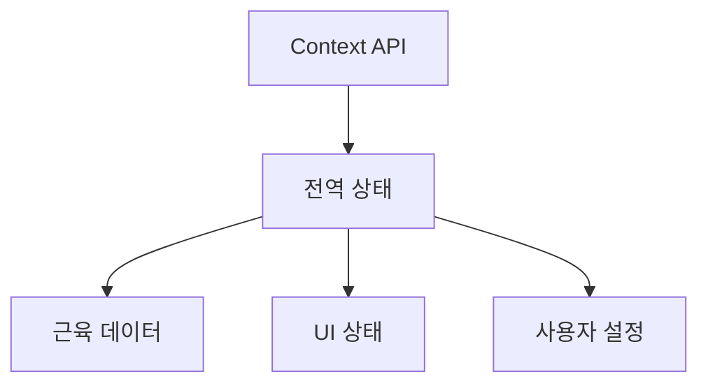

# ArmHealth 앱 요약

## 1. 기술 기반
- **프레임워크**: Next.js 14 (React 기반)
- **스타일링**: Tailwind CSS
- **상태 관리**: React Context API
- **아이콘**: Lucide React

## 2. 주요 기능

## 3. 핵심 컴포넌트
1. **공통 컴포넌트**
   - Header (모든 화면 상단)
   - TabNavigation (하단 네비게이션)

2. **주요 화면**
   - HomeScreen (메인 대시보드)
   - ScanScreen (측정 화면)
   - ExerciseScreen (운동 가이드)
   - ProfileScreen (프로필)
   - SettingsScreen (설정)

## 4. 주요 특징
- **다크모드**: 시스템/사용자 설정 기반
- **반응형**: 모바일 우선 디자인
- **애니메이션**: 부드러운 전환 효과
- **데이터 관리**: 로컬 스토리지 활용

## 5. 데이터 흐름

## 6. 구현된 기능
1. **근육 상태 모니터링**
   - 부하 수준 표시
   - 권장 사항 제공

2. **측정 프로세스**
   - 디바이스 연결
   - 실시간 데이터 수집
   - 결과 분석

3. **운동 가이드**
   - 단계별 설명
   - 타이머 기능
   - 진행 상태 표시

## 7. 성능 고려사항
- 컴포넌트 메모이제이션
- 이미지 최적화
- 코드 스플리팅
- 애니메이션 최적화 